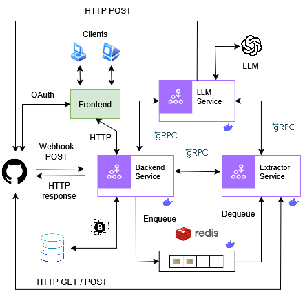
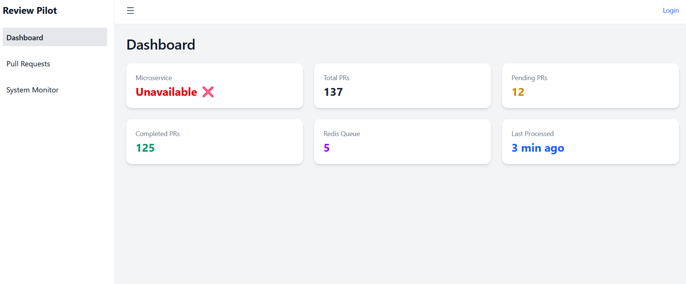
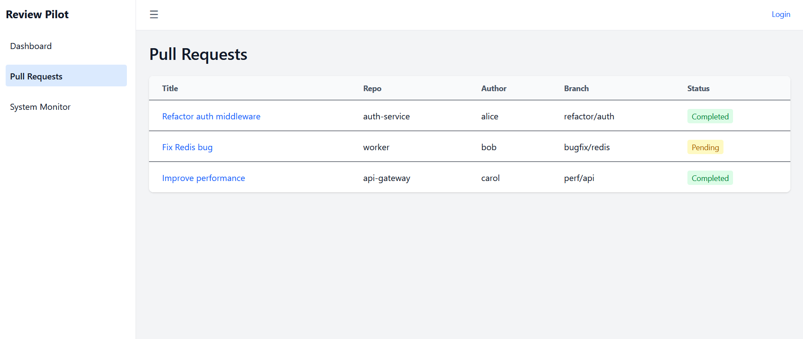

# Review Pilot

**Review Pilot** is a code review system powered by open-source LLMs. It integrates directly with GitHub Pull Requests to automate intelligent code review, leveraging a microservice architecture with Redis, gRPC, and Dockerized services.

## High-level Planned Architecture



## Goals

- ✅ Automatically trigger analysis when a GitHub PR is opened
- ✅ Use Redis as a lightweight message broker for task queuing
- ✅ Extract PR metadata and file diffs using GitHub API
- ✅ Run the diff through an open-source LLM to generate review comments
- 🔜 Push comments back to GitHub via API
- 🔜 Enable a UI dashboard for developers to track PR analysis
- 🔜 Provide full observability into code analysis, LLM confidence, and review cycles

## Data flow

- **Frontend** (React + TypeScript): Web interface to view review progress, reports, PR feedback
- **Backend (main microservice)**: Receives GitHub Webhooks → sends payloads to Redis
- **Extractor**: Pulls payloads from Redis → calls GitHub API → structures diff → sends to LLM
- **LLM Microservice**: Analyzes code via local LLM → generates feedback
- **Redis**: Acts as message queue between Ingestor and Extractor
- **GitHub API**: Used to fetch PR metadata, files, and post review comments
- **Database (Planned)**: For tracking PR history, feedback records, and auth sessions
- **Security layer (Planned)**: To secure inter-service communication and OAuth login

## Microservices

### Backend service

- Location: `backend/backend`
- Port: `8080`
- Endpoint: `POST /webhook`
- Responsibilities:
  - Receives GitHub webhook events
  - Queues payload to Redis

### Extractor service

- Location: `backend/extractor`
- Port: `8081`
- Endpoint: `GET /next-payload`
- Responsibilities:
  - Dequeues and parses GitHub payload
  - Fetches file diff and metadata via GitHub API
  - Sends structured data to LLM microservice via gRPC

### LLM service
- Location: `backend/llm_service`
- Port: `9000`
- Endpoint: `GET /review`
- Service that:
  - Accepts parsed PR data
  - Runs LLM models for static analysis
  - Returns suggested review comments

### Frontend _(soon)_

- React + TypeScript app
- Displays:
  - Status of reviews
  - GitHub-linked PR details
  - Review suggestions
  - Confidence/quality scores

- Snaps of the current frontend:

  
  

## Running locally

### Prerequisites

- Java 17+
- Maven
- Docker
- GitHub personal access token
- Webhook configured on your GitHub repo

### 1. Clone repository

```bash
git clone https://github.com/onapte/review-pilot.git
cd review-pilot
```

### 2. Start Redis

```bash
docker run --name redis-dev -p 6379:6379 -d redis
```

### 3. Run Backend service (Java - Spring boot)

```bash
cd backend/backend
./mvnw spring-boot:run
```

### 4. Run Extractor service (Java - Spring boot)

```bash
cd ../extractor
./mvnw spring-boot:run
```

### 5. Run LLM service (Python - FastApi)
```bash
cd ../llm_service
uvicorn llm_service:app --port <PORT> --reload
```

## Tech stack

- Java + Spring Boot
- Python + FastApi (for LLM integration)
- Redis (via Docker)
- GitHub Webhooks + REST APIs
- gRPC
- React + TypeScript
- LLM (current: `mistral-small`)

## Directory structure

(**LLM service** to be implemented next)

```bash
ReviewPilot/
├── backend/
│   ├── backend/      # -> Backend service
│   └── extractor/    # -> Extractor service
│   └── llm_service/  # -> Recently added
├── frontend/         # -> React dashboard (Planned)
├── docker-compose.yml (planned)
├── README.md
```

## Recently added (Update 1)

### Fast-API based LLM microservice

- The LLM microservice is now implemented in Python using FastAPI for simplicity and rapid experimentation.
- It uses Mistral AI models for generating intelligent, natural-language code reviews from GitHub Pull Request patches.
- The service exposes a `/review` endpoint that accepts `filename` and `patch` and returns bullet-point feedback.

### Redis

- The project uses Redis Lists to queue webhook payloads in a FIFO (First-In, First-Out) order.
- This mechanism ensures that earliest received webhooks are processed first (`leftPush` and `rightPop`)

### Planned next steps

- Convert the Python FastAPI LLM service to a containerized gRPC-compatible microservice.
- Integrate the code from frontend (React dashboard).
- Implement gRPC between microservices using ProtoBuf.
- Containerize all the microservices.
- Track LLM confidence, latency, and feedback via a metrics pipeline in the LLM service.

## Sample IO

### Sample Input - payload from github webhook
**Note**: Some confidential info has been removed from this sample payload.
```bash
{
  "action": "opened",
  "number": 1,
  "pull_request": {
    "url": "https://api.github.com/repos/onapte/temporal-minds/pulls/1",
    "id": "<ID>",
    "html_url": "https://github.com/onapte/temporal-minds/pull/1",
    "diff_url": "https://github.com/onapte/temporal-minds/pull/1.diff",
    "patch_url": "https://github.com/onapte/temporal-minds/pull/1.patch",
    "issue_url": "https://api.github.com/repos/onapte/temporal-minds/issues/1",
    "number": 1,
    "state": "open",
    "title": "Refactor text generation logic and modularize prompt construction",
    "user": {
      "login": "onapte",
      "id": "<GITHUB_ID>"
    },
    "body": "This PR refactors the original text generation script to improve readability, modularity, and maintainability.",
    "created_at": "2025-05-22T04:19:25Z",
    "updated_at": "2025-05-22T04:19:25Z",
    "head": {
      "ref": "alt-branch-1",
      "sha": "<SHA>"
    },
    "base": {
      "ref": "main",
      "sha": "<SHA>"
    }
  },
  "repository": {
    "id": "<GITHUB_ID>",
    "name": "temporal-minds",
    "full_name": "onapte/temporal-minds"
  },
  "sender": {
    "login": "onapte",
    "id": "<GITHUB_ID>"
  }
}
```

### Sample Output - review from the LLM

```bash
LLM Review Summary

# Bugs or Logical Errors
Device Handling:
-> device = -1 is invalid for PyTorch. Use device=0 for CPU or the appropriate GPU index (e.g., device=0 for the first GPU).

Unsupported Model Handling:
-> The ValueError for unsupported models is a good start but could be improved by listing supported models.

Output Handling:
-> The fallback in generate_response assumes the output is a list of dicts containing "generated_text". This may not hold across all models—handle this more robustly.

# Readability or Style Issues
Function Naming:
-> Renaming load_generator to initialize_generator improves clarity. Ensure consistency across all uses.

Docstrings:
-> Including docstrings is a good practice. Maintain consistent formatting and thoroughness.

Variable Naming:
-> Changing persona_name to persona improves consistency.

String Formatting:
-> Using f-strings for multi-line prompt construction (as in format_prompt) increases readability.

Magic Numbers:
-> Values like max_length=256, temperature=0.5, etc., are hardcoded. Prefer constants or configuration files.

Unused Imports:
-> The torch import is unused and should be removed to clean up the code.

# Suggestions for Improvement
Error Handling:
-> Add robust error handling around model loading and inference to gracefully manage failures.

Configuration Management:
-> Consider extracting model parameters (e.g., temperature, max length) into a config file or use environment variables.

Logging:
-> Replace print statements with logging for better debugging and production-readiness.

Type Hints:
-> Add type hints to function definitions for better maintainability and readability.

Unit Tests:
-> Implement unit tests for individual functions to ensure correctness and reliability.

# Good Practices Used
Docstrings:
-> Each function includes a descriptive docstring—great for maintainability.

Modularization:
-> Splitting logic into smaller functions (format_prompt, generate_response, etc.) is a solid design choice.

Error Messaging:
-> Raising ValueError for unsupported models is an effective way to handle misuse.

Consistent Naming:
-> The refactoring improves naming clarity and alignment across the codebase.
```

## Note
Built by @onapte. PRs, ideas, or contributions are welcome!
